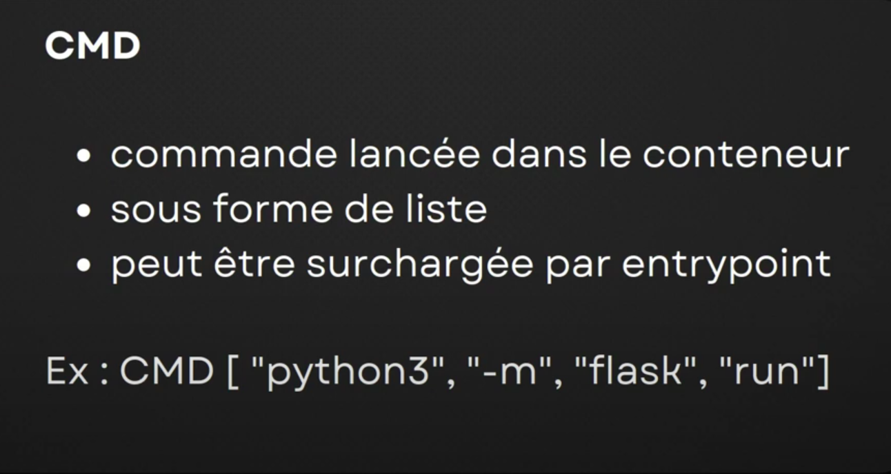
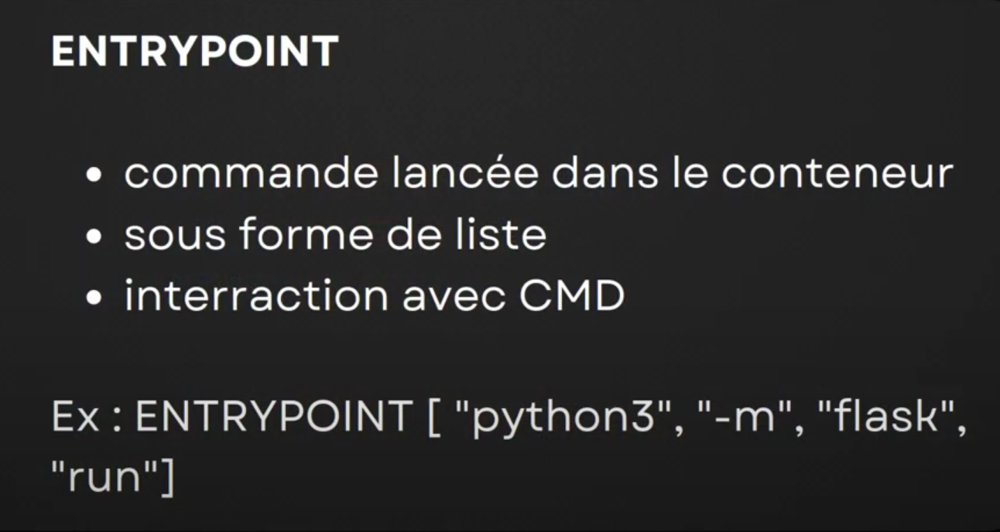

# Examen Docker
__FINIAVANA RANARIMANANA  Liana MIharisoa__  
*L1A/135/24-25*            
 
 

## Généralité sur Docker
__Docker__ est un est outil qui a perimis de populariser la conteneurtisation qui est finalement un mode de mutualisation ou de virtualisation des serveurs sur des machines physiques ou machines virtuelles.
1. Objectifs
* Simplifier les deploiements
* Changer le mode de livrable
* Faciliter la gestion des dépenedances
 

2. Concepts ou principes  
**Image** (enveloppe de stockage) : un élément inactif, une sorte de méta package qui contient à la fois du code et des éléments statiques :
- Code du/des programme(s)
- Toutes les dépendances

**Conteneur** : c'est l'activation d'une image de manière à faire tourner le processus :
- Un ou plusieurs process
- Isolation : cgroups / namespaces

 
 

## Les commandes basiques sur Docker
---
sudo usermod -aG docker $USER
---
Cette commande permet d'ajouter l'utilisateur au groupe docker. Cela t’autorise à exécuter Docker sans devoir mettre sudo à chaque fois.
 

---
docker ps
---
Cette commande permet d’afficher la liste des conteneurs Docker en cours d'exécution.
 

---
docker ps -a
---
Sert à voir tous les conteneurs, qu'ils soient actifs ou non.  
Elle montre des informations comme :
* l'ID du conteneur
* l'image utilisée
* l'état (en cours d'exécution ou stoppé)
* la commande lancée
* les ports
* la durée d'exécution
 

---
docker ps -q
---
Liste seulement les IDs des conteneurs Docker actifs.
 

---
docker ps -qa
---
Cette commande affiche uniquement les IDs de tous les conteneurs Docker, qu’ils soient actifs ou arrêtés.
 

---
docker run nginx:latest
---
Sert à télécharger (si nécessaire) et démarrer un conteneur qui exécute le serveur web Nginx.
L'image nginx:latest utilise la dernière version de Nginx.
Cette commande lance Nginx dans un conteneur, prêt à fonctionner.
 

---
docker run -d nginx:latest
---
Cette commande sert à démarrer un conteneur avec l’image Nginx en mode détaché (en arrière-plan).
L’option -d permet de laisser le conteneur tourner en arrière-plan sans bloquer le terminal.
 

---
docker run -d --name c1 nginx:latest
---
Cette commande lance Nginx dans un conteneur nommé c1, qui tourne en arrière-plan.
 

---
docker rm -f c1
---
Cette commande sert à supprimer immédiatement le conteneur c1, même s'il est encore en cours d'exécution.
 

---
docker run -ti --name c1 debian:latest
---
Elle démarre un conteneur Debian avec accès au terminal pour exécuter des commandes, dans un conteneur nommé c1.
 

---
docker run -ti --rm --name c1 debian:latest
---
Cette commande lance un conteneur Debian interactif, nommé c1, qui sera supprimé dès qu'on quittera le terminal.
 
 

## Docker Volume
Un *Docker Volume* est un espace de stockage persistant et partagé que Docker utilise pour conserver les données des conteneurs, même si le conteneur est supprimé ou recréé.
 

__Intérêts:__  
* Facile pour persister de la donnée
* Pratique pour faire les backups
* Partager entre de multiple conteneur
* Multiconteneurs & permissions
* Locals ou distants

---
docker volume ls
---
Cette commande affiche la liste de tous les volumes Docker présents sur la machine.  
Elle nous montre les noms des volumes créés, ce qui permet de savoir quels espaces de stockage persistent sont disponibles.
 

---
docker volume create mynginx
---
Cette commande crée un volume Docker nommé mynginx.  
Ce volume servira à stocker des données de façon persistante, par exemple pour un conteneur Nginx, afin que les données restent même si le conteneur est supprimé.
 

---
docker run -d --name c1 -v mynginx:/usr/share/ngninx/html/ ngninx:latest 
---
Elle monte un volume Docker nommé mynginx dans le dossier /usr/share/nginx/html/ du conteneur, qui est l’emplacement où Nginx sert les fichiers web. Grâce à ce montage, les fichiers stockés dans le volume persistent indépendamment du conteneur, ce qui permet de conserver les données même si le conteneur est arrêté ou supprimé.
 

---
docker exec -ti c1 bash
---
Cette commande permet d’ouvrir un terminal interactif (bash) dans le conteneur c1.  
Concrètement, elle nous donne un accès direct à l’intérieur du conteneur pour exécuter des commandes Linux comme si on était connecté sur une machine normale.
 

---
docker volume inspect ngninx
---
Cette commande permet d’afficher les détails du volume Docker ngninx.  
Elle te montre des informations précises, comme :
* le chemin exact où le volume est stocké sur ta machine
* le nom du volume
* le type de volume
* d'autres métadonnées
 

### Types de Docker Volumes

On a déjà vu précédemment le *Docker Volume*, parlons tout de suite le *Bind Mount*.
 
 
#### Bind Mount
Le Bind Mount est un type de volume Docker qui permet de monter un dossier directement depuis la machine (l'hôte) vers un conteneur Docker.  
__Comment ça marche?__
* On indique un chemin absolu sur la machine
* Ce dossier devient accessible à l'intérieur du conteneur dans un dossier qu'on choisis
* Toute modification dans ce dossier (dans le conteneur ou sur la machine) sera immédiatement visible des deux côtés
 

__*Voici un exemple*__
---
sudo mkdir /data  
sudo mkdir /data2  
sudo touch /data/Hello  
sudo mount --bind /data/ /data2  
sudo findmnt 
---  
On s'intéresse sur la 4ème ligne de commande;  
* Cela fait pointer /data2 vers /data.
* Les deux répertoires deviennent identiques : ce qu'on met dans /data apparaît dans /data2, et inversement
* C'est comme un raccourci monté ou un "miroir" au niveau du système de fichiers
* Très utilisé pour :
    * Accéder à un dossier à partir de plusieurs emplacements
    * Sécuriser l’accès à un sous-dossier sans déplacer les fichiers

Pour la 5ème ligne, elle affiche tous les systèmes de fichiers montés et on y verra une ligne montrant que /data est monté aussi sur /data2.  

 
 
 
Lorsqu'on réalise un montage d'un volume, on va avoir 2 comportements différents:  
* Pour le cas de *Bind Mount*, on va surcharger les datas à partir des données sources du volume sur notre image donc on va écraser potontiellemnt les données qui sont présentes dans l'image au niveau de notre montage
* En revanche, pour le *Docker Volume*, c'est l'inverse, c'est à dire qu'on va prendre ce qui est dans l'image et ça va venir alimenter le volume qu'on va créer à l'extérieur varlip docker volume...   
 

__Bind Mount__
---
docker run -d --name c1 --mount type=bind,source=/data/,destination=/usr/share/nginx/html/ nginx:latest
---
Cette commande lance un conteneur Nginx en arrière-plan et relie le dossier /data/ de la machine au dossier web /usr/share/nginx/html/ du conteneur. Ainsi, les fichiers dans /data/ sont directement servis par Nginx. C’est un Bind Mount qui facilite le partage de fichiers entre l’hôte et le conteneur.  
Et si on lance la commande __*docker inspect --format "{{.Mounts}}" c1*__ après, elle inspecte le conteneur c1 pour afficher uniquement les informations sur les montages (volumes et Bind Mounts). Et elle affichera:  
* Le type de montage (bind ou volume)
* Le chemin sur l’hôte (Source)
* Le chemin dans le conteneur (Destination)
* Les options associées  
 

__Docker Volume__
---
docker run -d --name c2 --mount type=volume,source=mynginx,destination=/usr/share/nginx/html/ nginx:latest
---
Lors de cette étape, nous avons constaté que les résultats obtenus sont similaires à ceux que nous avions déjà rencontrés précédemment. Cela confirme que le fonctionnement reste identique et que les concepts abordés auparavant s'appliquent toujours ici.  
 
 

## Docker Networks
C'est un élément important pour le foctionnement des conteneurs à la fois pour la communications entre conteneurs mais également pour les entrées et sorties au niveau des flux entre le conteneur et l'extérieur de la machine host.  
 
 

1. Bridge  
Le mode bridge est le mode réseau par défaut de Docker lorsqu'on crée un conteneur. Il permet à plusieurs conteneurs de communiquer entre eux sur un réseau privé isolé, tout en restant séparés du réseau principal de l’hôte (ton ordinateur/serveur).
 

 

Le bridge par défaut pour docker c'est docker0 avec une IP 172.17.0.1/16 (configurable)
Il exiqte plusieurs manières de le visualiser sur notre host sur lequel on a installé docker:  
   * __ip a__
   * __sudo ifconfig__
   * __docker network ls__

Maitenant créons un conteneur
__docker run --name c1 -d debian sleep infinity__  
Ceci démarre un conteneur Debian c1 en arrière-plan, sans qu'il se ferme tout seul, car il exécute une commande qui ne s'arrête jamais. 
 

*Pourquoi utiliser cette commande?*  
Très pratique pour créer un conteneur de test "vide", où on peut entrer plus tard avec :  
__docker exec -ti c1 bash__  
On ouvre un terminal directement dans le conteneur Debian c1.  
On se retrouve "à l’intérieur" du conteneur, comme si c'était une petite machine virtuelle Debian et on va visualiser les IP.  
 

D'abord il faut installer la commande *ip*, donc voici la commande:  
__apt install iputils-ping net-tools__  
Dans un conteneur Debian, la commande apt install iputils-ping net-tools permet d’installer des outils réseau essentiels pour le diagnostic et les tests. Le paquet iputils-ping fournit la commande ping, qui permet de tester la connectivité réseau en envoyant des paquets ICMP à une adresse IP ou un nom de domaine, afin de vérifier si la machine cible répond. Quant au paquet net-tools, il contient plusieurs commandes réseau classiques telles que ifconfig pour afficher et configurer les interfaces réseau, netstat pour examiner les connexions et ports ouverts, ainsi que d’autres outils comme route et arp. Ces outils sont particulièrement utiles à l’intérieur d’un conteneur pour vérifier l’état du réseau, observer les interfaces et s’assurer de la connectivité avec d’autres conteneurs ou avec l’extérieur. Cependant, ils ne sont pas inclus par défaut dans les images Docker minimales afin de réduire la taille de l’image et ne sont installés que si nécessaire.  
 

Et si on lance maintenant la commande __ifconfig__ dans ce bash, on y trouve:  
* Les interfaces réseau actives (exemple : eth0, lo, docker0)
* Les adresses IP attribuées
* Les adresses MAC
* Le masque de sous-réseau
* L’état des interfaces (UP/DOWN)
* Les statistiques de paquets réseau (envoyés, reçus, erreurs, etc.)  
 
 

2. Lignes de commandes didiée au réseau
Le but c'est de créer notre propre réseau et de ne pas utliser docker0. Le docker0 ne permet pas de bénéficier de ce qu'on va voir c'est à dire la résolution de DNS à travers d'un nom de conteneur et qui va permettre de fournir tout de suite une IP.
 

---
docker network ls
---
Ceci permet d’afficher la liste de tous les réseaux Docker présents sur la machine. Chaque fois que Docker est installé, il crée automatiquement plusieurs réseaux par défaut, dont bridge, host et none. Le réseau bridge qu'on a déjà vu précédemment, le réseau host permet au conteneur d’utiliser directement le réseau de la machine hôte, sans isolation réseau; tandis que le réseau none désactive tout accès réseau pour le conteneur.  
 

---
docker network create --driver=bridge --subnet=192.168.0.0/24 réseau1
---
Cette commande sert à créer un réseau Docker privé nommé réseau1 avec le mode bridge et une plage d’adresses IP allant de 192.168.0.1 à 192.168.0.254. Elle permet aux conteneurs connectés à ce réseau de communiquer entre eux dans un sous-réseau isolé.  
 

---
docker network inspect réseau1
---
Cette commande affiche tous les détails du réseau Docker réseau1.  
Elle montre des informations comme :  
   * Le type de réseau (bridge)
   * Le sous-réseau utilisé (ici 192.168.0.0/24)
   * Les adresses IP attribuées
   * Les conteneurs connectés à ce réseau
   * La passerelle (gateway) du réseau  
 

---
docker run -d --name c1 --network réseau1 nginx:latest
---
Elle permet d’exécuter un conteneur Nginx, déjà connecté au réseau privé réseau1 qu'on a créé avant.  
 

Créons un autre conteneur Nginx nommé c2, donc:  
___docker run -d --name c2 --network réseau1 nginx:latest___  
Ouvrons maitenant un terminal interactif dans ce conteneur d’y lancer un shell bash:  
__docker exec -ti c2__  
   > *apt install iputils-ping* : cette commande installe le paquet iputils-ping, qui fournit l’outil ping.
L'outil ping permet de :
* Tester la connectivité réseau vers une autre machine ou un autre conteneur
* Envoyer des paquets ICMP pour vérifier si la destination répond
* Mesurer le temps de réponse (latence) entre les deux machines
   > *ping c1* : sert à tester la connexion réseau entre conteneurs Docker c2, tant qu’ils sont sur le même réseau.
Le résulat ping à partir de quel DNS? Donc on y trouve le conteneur c1.réseau1, donc c'est ça le DNS; c'est à dire le nom d'un conteneur suivi d'un "." et suivi du nom du réseau custom qu'on a utilisé pour notre conteneur.  
 
 
  
## Dockerfile
Le Dockerfile est comme une recette de cuisine : chaque instruction a son rôle pour créer une image Docker personnalisée, prête à être utilisée. Il sert à automatiser la création d’images Docker.  
Dans ce fichier, tu indiques :  
* Quelle image de base utiliser (par exemple : Debian, Ubuntu, Nginx…)
* Quelles commandes exécuter à l’intérieur (installer des logiciels, copier des fichiers, etc.)
* Quelle application démarrer dans le conteneur
 

Voici les instructions de Dockerfile

